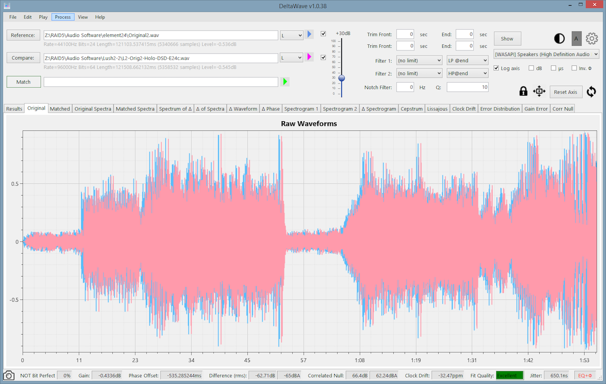

---
# You don't need to edit this file, it's empty on purpose.
# Edit theme's home layout instead if you wanna make some changes
# See: https://jekyllrb.com/docs/themes/#overriding-theme-defaults
sidebar: mydoc_sidebar
layout: "page"
toc: false
title: DeltaWave Audio Null Comparator
comments: true
---

## <a href="DeltaWaveSetup.zip">Download 64-bit  <input type="image" id="download" alt="Download" src="images/windows-logo.png" width="30" align="top">   </a>
 
[Release notes](pages/mydoc/release_notes_1.0b.md)

This is an early beta version of the software. Please check this website before then to get an updated copy!

## You may also be interested in these:
* <a href="https://distortaudio.org" target="_blank">DISTORT</a> - Your personal simulation of what various distortions do to audio
* <a href="https://distortaudio.org/earful.html">Earful</a> - An audiophile Hearing Test 

 Donate to help to support free audio software development or show your appreciation! 

<form action="https://www.paypal.com/donate" method="post" target="_top">
<input type="hidden" name="hosted_button_id" value="79SK4HAQSSP3Q" />
<input type="image" src="https://www.paypalobjects.com/en_US/i/btn/btn_donateCC_LG.gif" border="0" name="submit" title="PayPal - The safer, easier way to pay online!" alt="Donate with PayPal button" />

</form>

 


